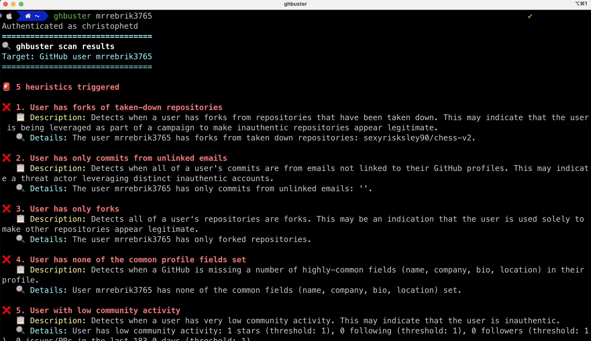

# ghbuster

**ghbuster** is a tool to detect suspicious GitHub repositories and users using heuristics. It is designed to help identify potentially malicious or inauthentic accounts and repositories on GitHub.

<p align="center">
  
</p>

## Usage

Install `uv` if needed:

```bash
brew install astral-sh/uv/uv
# or see https://docs.astral.sh/uv/getting-started/installation/ for other platforms
```

You can the install ghbuster:

```bash
uv pip install "git+https://github.com/DataDog/ghbuster.git"
```

Then run it using:

```bash
export GITHUB_TOKEN=<your_github_token>
ghbuster
```

## Heuristics

<!-- BEGIN_RULE_LIST -->
### Repository heuristics

| **ID** | **Name** | **Description** |
|:-:|:-:|:-:|
| [repo.commits_suspicious_unlinked_emails](./ghbuster/heuristics/repo_commits_only_from_suspicious_unlinked_emails.py) | Repository commits only from suspicious unlinked emails | Detects when a repository has commits with unlinked emails that also don't match the owner's username or full name. |
| [repo.stargazers_joined_same_day](./ghbuster/heuristics/repo_has_stargazzers_who_joined_the_same_day.py) | Repository has stargazers who joined the same day | Detects when a repository has a large proportion of its stargazers who joined GitHub on the same day, which may indicate a coordinated effort to boost the repository's popularity. |
| [repo.starred_by_suspicious_users](./ghbuster/heuristics/repo_starred_by_suspicious_users.py) | Repository starred by suspicious users | Detects when a repository has over 80 % of stars from suspicious users matching heuristics they may be inauthentic. |


### GitHub user heuristics

| **ID** | **Name** | **Description** |
|:-:|:-:|:-:|
| [user.commits_unlinked_emails](./ghbuster/heuristics/user_has_only_commits_from_unlinked_emails.py) | User has only commits from unlinked emails | Detects when all of a user's commits are from emails not linked to their GitHub profiles. This may indicate a threat actor leveraging distinct inauthentic accounts. |
| [user.forks_from_taken_down_repos](./ghbuster/heuristics/user_has_forks_from_taken_down_repos.py) | User has forks of taken-down repositories | Detects when a user has forks from repositories that have been taken down. This may indicate that the user is being leveraged as part of a campaign to make inauthentic repositories appear legitimate. |
| [user.just_joined](./ghbuster/heuristics/user_metadata_basic.py) | User recently joined GitHub | The GitHub user joined the platform less than 7 days ago. |
| [user.low_community_activity](./ghbuster/heuristics/user_has_low_community_activity.py) | User with low community activity | Detects when a user has very low community activity. This may indicate that the user is inauthentic. |
| [user.missing_common_fields](./ghbuster/heuristics/user_metadata_basic.py) | User has none of the common profile fields set | Detects when a GitHub is missing a number of highly-common fields (name, company, bio, location) in their profile. |
| [user.repos_only_forks](./ghbuster/heuristics/user_has_only_forks.py) | User has only forks | Detects all of a user's repositories are forks. This may be an indication that the user is used solely to make other repositories appear legitimate. |


<!-- END_RULE_LIST -->

## Related research

- https://defcon.org/html/defcon-33/dc-33-speakers.html#content_60311
- https://securitylabs.datadoghq.com/articles/mut-1244-targeting-offensive-actors/

## Development

To run the local ghbuster version, use:

```bash
uv venv
export GITHUB_TOKEN=<your_github_token>
uv run python -m ghbuster
```

To run the tests, use:

```bash
uv run python -m unittest discover tests/heuristics
```

To generate the documentation, use:

```bash
uv run python -m scripts.generate_heuristics_docs README.md
```
